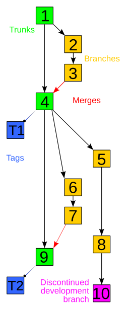

# Git i Github

## Przydatne linki

#### Git

- https://git-scm.com/learn
- https://git-scm.com/cheat-sheet
- https://git-scm.com/videos
- https://learn.microsoft.com/en-us/training/modules/intro-to-git/
- https://learngitbranching.js.org
- https://ohmygit.org
- https://git-scm.com/book/en/v2
- https://roadmap.sh/git
- https://rogerdudler.github.io/git-guide/

#### GitHub 
- https://docs.github.com/en/get-started/using-github/hello-world
- https://learn.microsoft.com/en-us/contribute/content/git-github-fundamentals

#### Kontrola wersji
- https://git-scm.com/book/pl/v2/Pierwsze-kroki-Wprowadzenie-do-kontroli-wersji
- https://www.atlassian.com/pl/git/tutorials/what-is-version-control

#### Visual Studio Code i git
- https://code.visualstudio.com/docs/sourcecontrol/repos-remotes

#### Warto znać!
- https://www.conventionalcommits.org/en/v1.0.0/
- https://gist.github.com/joshbuchea/6f47e86d2510bce28f8e7f42ae84c716

## Kontrola wersji,
nazywana również kontrolą źródła, to praktyka polegająca na śledzeniu zmian w kodzie oprogramowania i zarządzaniu tymi zmianami. Systemy kontroli wersji to narzędzia programowe, które pomagają zespołom tworzącym oprogramowanie zarządzać zmianami w kodzie źródłowym na przestrzeni czasu

## Git
jest obecnie najczęściej stosowanym nowoczesnym systemem kontroli wersji na świecie. Jest to dojrzały, aktywnie prowadzony projekt open source zainicjowany w 2005 roku przez Linusa Torvaldsa, słynnego twórcę jądra systemu operacyjnego Linux.
