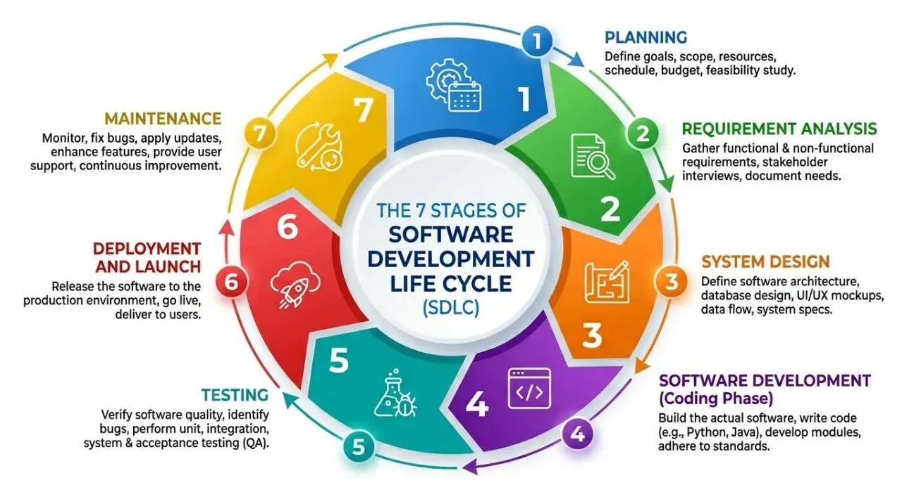

# Software Development Lifecycle

## Przydatne linki
- https://github.com/resources/articles/what-is-sdlc
- https://www.microsoft.com/en-us/power-platform/topics/phases-of-the-software-development-lifecycle
- https://www.atlassian.com/agile/software-development/sdlc
- https://nvlpubs.nist.gov/nistpubs/SpecialPublications/NIST.SP.800-160v1r1.pdf

---

Cykl rozwoju oprogramowania (**Software Development Life Cycle – SDLC**) według materiałów źródłowych składa się z **7 głównych etapów**:

## 1. Planowanie (Planning)  
   Stanowi fundament każdego projektu IT, na którym definiuje się cele, zakres przedsięwzięcia oraz wstępne wymagania. Na tym etapie określa się **budżet, harmonogram i dokonuje alokacji zasobów,** co chroni przed opóźnieniami i nieprzewidzianymi kosztami.

## 2. Analiza wymagań (Requirements  Analysis)  
   Obejmuje szczegółowe zebranie i badanie wymagań użytkowników i biznesu pod kątem ich spójności oraz wykonalności technicznej. Tworzenie precyzyjnej specyfikacji na tym etapie pozwala uniknąć kosztownych poprawek w dalszych fazach.

## 3. Projektowanie systemu (System Design)
   Definiuje się strukturę aplikacji, jej architekturę oraz zasady współdziałania komponentów. Wykorzystuje się przy tym diagramy UML, diagramy przepływu danych (*data flow diagrams*) oraz schematy modułowe w celu wizualizacji działania i budowy oprogramowania.

## 4. Programowanie / Tworzenie kodu (Coding Phase) 
   Przekształca się specyfikacje i projekty w funkcjonalny kod źródłowy. Zespoły stosują standardy kodowania, systemy kontroli wersji, przeglądy kodu (*code review*) oraz ewentualnie narzędzia low-code, aby przyspieszyć prace.

## 5. Testowanie (Testing)
   Aplikacja jest weryfikowana pod kątem błędów, usterek oraz wymogów bezpieczeństwa zanim trafi do środowiska produkcyjnego. Przeprowadza się m.in. testy jednostkowe (*unit testing*), integracyjne, systemowe oraz akceptacyjne/użytkownika (*user testing*).

## 6. Wdrożenie (Deployment and Launch)
   Przetestowane rozwiązanie trafia do środowiska produkcyjnego i zostaje udostępnione użytkownikom. Proces ten może obejmować fazę pilotażową/beta lub korzystać ze strategii wdrożeniowych takich jak *blue/green* lub *canary deployments*.

## 7. Utrzymanie i wsparcie (Maintenance) 
   Po uruchomieniu oprogramowania zapewnia się obsługę techniczną, usuwanie usterek, monitorowanie wydajności, aktualizacje bezpieczeństwa oraz dodawanie nowych funkcji w odpowiedzi na rozwijające się potrzeby lub w zakresie zdefiniowanym w umowie.

