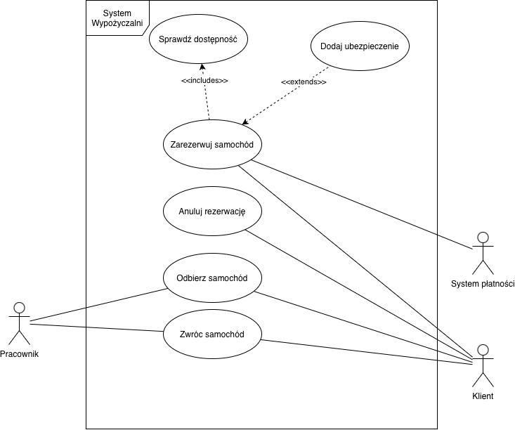
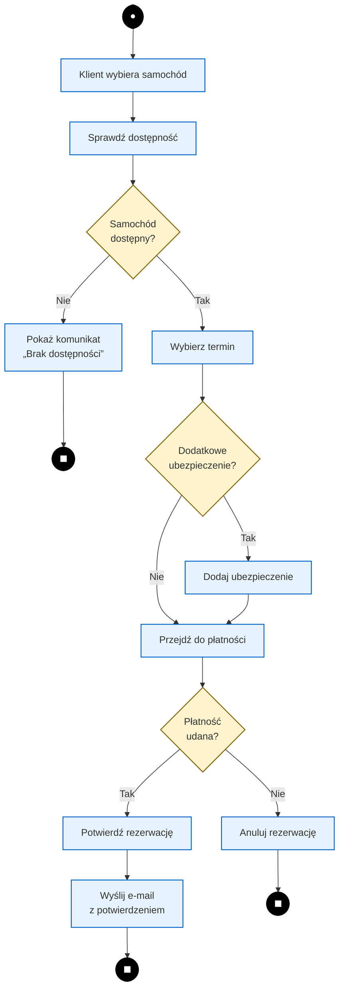

# Unified Modeling Language (UML)

UML to język służący do opisywania systemu za pomocą standardowych diagramów. Poszczególne diagramy pokazują system z różnych perspektyw.

| Diagram               | Odpowiada na pytanie                                               |
| --------------------- | ------------------------------------------------------------------ |
| **Przypadków użycia** | **Kto** korzysta z systemu i **co** może w nim zrobić?             |
| **Aktywności**        | **Jak przebiega** proces lub czynność?                             |
| **Sekwencji**         | **Kto z kim i w jakiej kolejności** się komunikuje?                |
| **Klas**              | **Z jakich klas/obiektów** składa się system i jakie mają relacje? |

## Przydatne linki
- https://zwinnaanaliza.pl
- https://uml.developpez.com - Strona w języku francuskim
- https://wolski.pro/diagramy-uml/diagram-przypadkw-uzycia/
- https://www.uml-diagrams.org/
- https://agilemodeling.com/artifacts/usecasediagram.htm
- https://www.andrew.cmu.edu/course/90-754/umlucdfaq.html
### Narzędzia
- PlantUML: https://www.plantuml.com/plantuml/uml/
- Mermaid: https://mermaid.live/
- draw.io / diagrams.net: https://app.diagrams.net/ 
### Diagram przypadków użycia (Use Case Diagram)
- https://www.uml-diagrams.org/use-case-diagrams.html
- https://wolski.pro/diagramy-uml/diagram-przypadkw-uzycia/
- https://agilemodeling.com/artifacts/usecasediagram.htm

## Co to jest UML?
* **UML (Unified Modeling Language)** to standaryzowany język modelowania służący do przedstawiania, specyfikowania, wizualizowania i dokumentowania systemów.
* Pozwala przedstawiać wymagania, strukturę i zachowanie systemu za pomocą przejrzystych diagramów.
* Nie określa konkretnej technologii ani sposobu implementacji. Pozwala natomiast opisywać m.in. co system ma robić, jak przebiegają procesy oraz z jakich elementów się składa.

## Czym są diagramy i po co się je stosuje?
Diagram UML to graficzna reprezentacja wybranych aspektów systemu, np. jego struktury, zachowania, procesów lub interakcji z użytkownikami.

### Dlaczego programiści i analitycy stosują diagramy?
* **Określenie granic i funkcji**: Pomagają precyzyjnie wyznaczyć zakres systemu – co wchodzi w skład aplikacji, a co znajduje się w jej otoczeniu.
* **Wspólny język**: Ułatwiają komunikację między osobami nietechnicznymi (klientami, biznesem) a zespołem deweloperskim (analitykami, programistami, testerami).
* **Weryfikacja postępów i testowanie**: Pomagają sprawdzić, czy zaprojektowane i zaimplementowane funkcje odpowiadają wymaganiom oraz ułatwiają przygotowanie scenariuszy testowych.
* **Dokumentacja**: Ułatwiają przedstawienie i udokumentowanie struktury oraz zachowania systemu na różnych etapach jego tworzenia.

### Diagramy przypadków użycia (Use Case Diagrams)
Diagram przypadków użycia to wysokopoziomowy diagram przedstawiający funkcje systemu z perspektywy jego użytkowników i innych systemów zewnętrznych.

#### Kluczowe elementy diagramu:
1. **Aktor (Actor)**:
   * Reprezentuje rolę pełnioną wobec systemu przez człowieka, urządzenie lub zewnętrzny system.
   * Aktor reprezentuje element zewnętrzny względem modelowanego systemu i znajduje się **poza jego granicą**.
2. **Przypadek użycia (Use Case)**:
   * Rysowany jako elipsa. Jego nazwa powinna krótko opisywać cel lub funkcję, np. Zaloguj się, Zarezerwuj samochód, Dodaj produkt do koszyka. Zwyczajowo w formie bezosobowej.
   * Reprezentuje zbiór scenariuszy realizujących konkretny i wartościowy cel użytkownika.
3. **Asocjacja / Połączenie (Association)**:
   * Linia ciągła łącząca aktora z przypadkiem użycia. Pokazuje, że aktor uczestniczy w realizacji danego przypadku użycia.
4. **Granica systemu (System Boundary Box)**:
   * Prostokąt wyznaczający granicę modelowanego systemu. Przypadki użycia znajdują się wewnątrz granicy systemu, natomiast aktorzy – na zewnątrz.

#### Relacje między przypadkami użycia:
* **Zawieranie (`<<include>>`)**: Jeden przypadek użycia zawsze korzysta z zachowania zdefiniowanego w innym przypadku użycia. Stosuje się je, gdy dane zachowanie jest obowiązkową częścią realizacji przypadku bazowego.
  
    Przykład: Złóż zamówienie zawsze obejmuje Sprawdź dostępność produktu.
* **Rozszerzenie (`<<extend>>`)**: Opcjonalne lub warunkowe rozszerzenie podstawowego przypadku użycia o dodatkowe zachowanie. Rozszerzenie wykonywane jest tylko w określonych sytuacjach.

    Przykład: podczas Rezerwacji samochodu klient może dodatkowo wybrać Dodatkowe ubezpieczenie.

#### Przykład

### Diagram aktywności (UML Activity Diagram)

Diagram przepływu (flowchart) oraz diagram aktywności UML (activity diagram) służą do przedstawiania przebiegu procesu, algorytmu lub zestawu czynności. Pozwalają pokazać kolejność działań, decyzje, pętle oraz różne możliwe ścieżki wykonania.

 W przeciwieństwie do diagramu przypadków użycia (który pokazuje ogólne zestawienie funkcji z wysoka), diagram aktywności przedstawia przebieg procesu, kolejność wykonywania czynności oraz możliwe rozgałęzienia i powtórzenia.

#### Po co stosuje się diagramy aktywności?
* **Modelowanie dokładnego przebiegu zdarzeń**: Pozwalają pokazać kolejność czynności wykonywanych w ramach procesu, wraz z możliwymi decyzjami, powtórzeniami i zakończeniami poszczególnych ścieżek.
* **Przedstawianie pętli, rozgałęzień i błędów**: Umożliwiają przedstawienie warunków, rozgałęzień, pętli oraz różnych scenariuszy wykonania, np. sytuacji zakończenia operacji błędem.
* **Opis szczegółowy scenariuszy przypadków użycia**: Przypadek użycia określa cel aktora, natomiast diagram aktywności może przedstawiać kolejne kroki realizacji tego celu, w tym scenariusz główny i scenariusze alternatywne.

#### Podstawowe elementy diagramu przepływu / aktywności:
* **Węzeł początkowy i końcowy**: Wskazują odpowiednio początek i zakończenie przepływu
* **Akcja / Aktywność**: Czynność wykonywana w ramach procesu, np. Sprawdź dostępność produktu.
* **Węzeł decyzyjny**: Umożliwia wybór jednej z kilku ścieżek w zależności od spełnienia określonego warunku. (np. *Czy płatność się powiodła?* -> Tak / Nie).
* **Przepływ sterowania**: Pokazuje kolejność przechodzenia między kolejnymi czynnościami.
#### Przykład

### Diagram przypadków użycia a diagram aktywności

| Cecha | Diagram Przypadków Użycia (Use Case Diagram) | Diagram Aktywności (Activity Diagram) |
| :--- | :--- | :--- |
| **Perspektywa** | Perspektywa użytkownika/aktora – pokazuje dostępne funkcje systemu i uczestników tych funkcji. | Perspektywa procesu – pokazuje, jak przebiega dana czynność lub proces oraz jakie są możliwe ścieżki jego wykonania.|
| **Co przedstawia?** | Zbiór dostępnych funkcji systemu oraz to, **kto** z nich korzysta. | Przebieg procesu: kolejność czynności, decyzje, pętle oraz możliwe ścieżki wykonania. |
| **Kolejność zdarzeń** | Nie pokazuje kolejności wykonywania czynności ani szczegółowego przebiegu procesu. | **Modeluje sekwencję zdarzeń w czasie** od punktu startowego do końcowego. |
| **Poziom szczegółowości** | Wysoki poziom – przedstawia system z perspektywy jego funkcji i aktorów, bez opisywania szczegółowego przebiegu każdej funkcji. | Bardziej szczegółowy – może przedstawiać kolejne czynności i warunki występujące podczas realizacji procesu.         |
| **Główne elementy**       | Aktorzy, przypadki użycia, granica systemu oraz relacje między nimi.                                                            | Akcje/aktywności, węzły początkowe i końcowe, węzły decyzyjne oraz przepływy sterowania.                             |
| **Zastosowanie** | Określanie wymagań funkcjonalnych i granic aplikacji. | Szczegółowe modelowanie procesów, algorytmów i scenariuszy przypadków użycia. |
| **Przykładowe pytanie**   | **„Kto może korzystać z systemu i jakie funkcje może wykonać?”**                                                                | **„Jak krok po kroku przebiega dana operacja?”**                                                                     |

## Jak wybrać odpowiedni diagram?

**Chcesz pokazać, kto korzysta z systemu i jakie funkcje są dostępne?**
→ Diagram przypadków użycia.

**Chcesz pokazać, jak przebiega proces lub algorytm?**
→ Diagram aktywności.

**Chcesz pokazać komunikację między obiektami w określonej kolejności czasowej?**
→ Diagram sekwencji.

